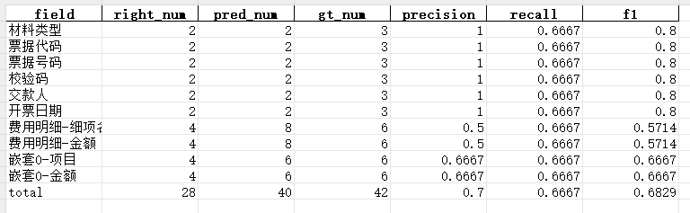

## 多模态模型代码库

### 代码
- examples
  - 模型训练,推理脚本
- mllm
  - 模型代码
- notebooks
  - 主流的模型tutorial
- scripts
  - 数据预处理代码,模型评估脚本
- third_party
 
### 数据处理
- 图片来源：网上爬虫+书籍pdf   
- 数据转换：将书籍pdf转为图片   
- 图片ocr：将数据数据调用ppcor转成文本+box(目前为了进行数据校验,生成为ppocrlabel格式)    
- 数据校验：使用ppocrlabel对ocr结果进行纠正   
- 构建csv索引数据：mllm-data.csv, 包括图片路径,ocr结果,图片size,类型,用途    
- 根据mllm-data.csv,生成arrow数据集(非必要)

### 模型
- Donut
- InternVL
- QWenVL

### 通用评估脚本
- scripts/field_metric/metric_f1.py
  
  - 支持复杂的数据结构评估, 如:
  ```python
  pred = {
        "材料类型": "电子发票",
        "票据代码": "50068122",
        "票据号码": "8250626222",
        "校验码": "edfdf4",
        "交款人": "冯xx",
        "开票日期": "2023年03月16日",
        "费用明细": [
            {"细项名称": "卫生材料费", "金额": "8.98"},
            {"细项名称": "治疗费", "金额": "3.4"},
            {"细项名称": "化验费", "金额": "76.5"}
        ],
        "嵌套0": [
            {"项目": "检查费", "金额": "50.00"},
            {"项目": "化验费", "金额": "60.00"}
        ]
    }

  gt = {
        "材料类型": "电子发票",
        "票据代码": "50068122",
        "票据号码": "8250626222",
        "校验码": "edfdf4",
        "交款人": "冯xx",
        "开票日期": "2023年03月16日",
        "费用明细": [
            {"细项名称": "卫生材料费", "金额": "8.98"},
            {"细项名称": "治疗费", "金额": "3.4"},
        ],
        "嵌套0": [
            {"项目": "检查费", "金额": "50.00"},
            {"项目": "化验费", "金额": "60.00"}
        ]
    }

  # Run comparison
  # match_info_one = compute_one_metric(pred, gt)
  match_info = compute_f1_metric([{}, pred, pred], [gt, gt, gt])

  save_csv_file(match_info, "test.xlsx")
  ```
  字段评估样例
  

### JSON-LLM序列化与反序列化
#### JSON序列化
上面的gt数据使用json2tokenV2函数会序列化成(使用\n\n进行拼接),prefix_list_of_dict=True保留list_of_dict的key结构,否则不保留,支持复杂data数据:
- prefix_list_of_dict=True
```text
材料类型:电子发票

票据代码:50068122

票据号码:8250626222

校验码:edfdf4

交款人:冯xx

开票日期:2023年03月16日

费用明细-细项名称:卫生材料费		费用明细-金额:8.98

费用明细-细项名称:治疗费		费用明细-金额:3.4

费用明细-细项名称:化验费		费用明细-金额:76.5

嵌套0-项目:检查费		嵌套0-金额:50.00

嵌套0-项目:化验费		嵌套0-金额:60.00

嵌套1-嵌套2-项目:检查费		嵌套1-嵌套2-金额:70.00

嵌套1-嵌套2-项目:化验费		嵌套1-嵌套2-金额:80.00
```
- prefix_list_of_dict=False
```text
'材料类型:电子发票

票据代码:50068122

票据号码:8250626222

校验码:edfdf4

交款人:冯xx

开票日期:2023年03月16日

细项名称:卫生材料费		金额:8.98

细项名称:治疗费		金额:3.4

细项名称:化验费		金额:76.5

项目:检查费		金额:50.00

项目:化验费		金额:60.00

项目:检查费		金额:70.00

项目:化验费		金额:80.00'
```
#### JSON反序列化
- prefix_list_of_dict=True
```json
{
    '材料类型': '电子发票', 
    '票据代码': '50068122', 
    '票据号码': '8250626222', 
    '校验码': 'edfdf4', 
    '交款人': '冯xx', 
    '开票日期': '2023年03月16日', 
    '费用明细': [
      {'细项名称': '卫生材料费', '金额': '8.98'},
      {'细项名称': '治疗费', '金额': '3.4'}, 
      {'细项名称': '化验费', '金额': '76.5'}
    ], 
    '嵌套0': [
      {'项目': '检查费', '金额': '50.00'}, 
      {'项目': '化验费', '金额': '60.00'}
    ], 
    '嵌套1': [
      {'嵌套2-项目': '检查费', '嵌套2-金额': '70.00'}, 
      {'嵌套2-项目': '化验费', '嵌套2-金额': '80.00'}
    ]
}
```
- prefix_list_of_dict=False
```json
{
  '材料类型': '电子发票', 
  '票据代码': '50068122', 
  '票据号码': '8250626222', 
  '校验码': 'edfdf4', ]
  '交款人': '冯xx', 
  '开票日期': '2023年03月16日', 
  'groups': [
    {'细项名称': '卫生材料费', '金额': '8.98'}, 
    {'细项名称': '治疗费', '金额': '3.4'}, 
    {'细项名称': '化验费', '金额': '76.5'}, 
    {'项目': '检查费', '金额': '50.00'}, 
    {'项目': '化验费', '金额': '60.00'}, 
    {'项目': '检查费', '金额': '70.00'}, 
    {'项目': '化验费', '金额': '80.00'}
  ]
}
```

### 考虑下游任务（主要数据难获取）
#### 火车票字段抽取
- internvl
```shell
CUDA_VISIBLE_DEVICES=0 swift sft \
  --model_type internvl2-1b \
  --model_id_or_path /mnt/n/model/OpenGVLab/InternVL2-1B \
  --output_dir /mnt/n/model/sft-model/trainticket-sft \
  --dataset /mnt/n/data/mllm-data/mllm-finetune-data/trainticket/swift_label/metadata_train.jsonl \
  --val_dataset /mnt/n/data/mllm-data/mllm-finetune-data/trainticket/swift_label/metadata_val.jsonl \
  --max_length 1024 \
  --gradient_accumulation_steps 8 \
  --eval_steps 200 \
  --save_steps 200 \
  --num_train_epochs 10 \
  --batch_size 1 \
  --learning_rate 3e-4 \
  --lr_scheduler_type cosine \
  --sft_type lora \
  --lora_target_modules ALL \
  --weight_decay 0.1 \
  --max_grad_norm 0.5 \
  --dtype fp16 \
  --lora_dtype fp16 \
  --lora_rank 8 \
  --lora_alpha 32 \
  --lora_dropout 0.05 \
  --do_sample False \
  --warmup_ratio 0.05 \

#  --gradient_checkpointing True \
#  --predict_with_generate True \
```